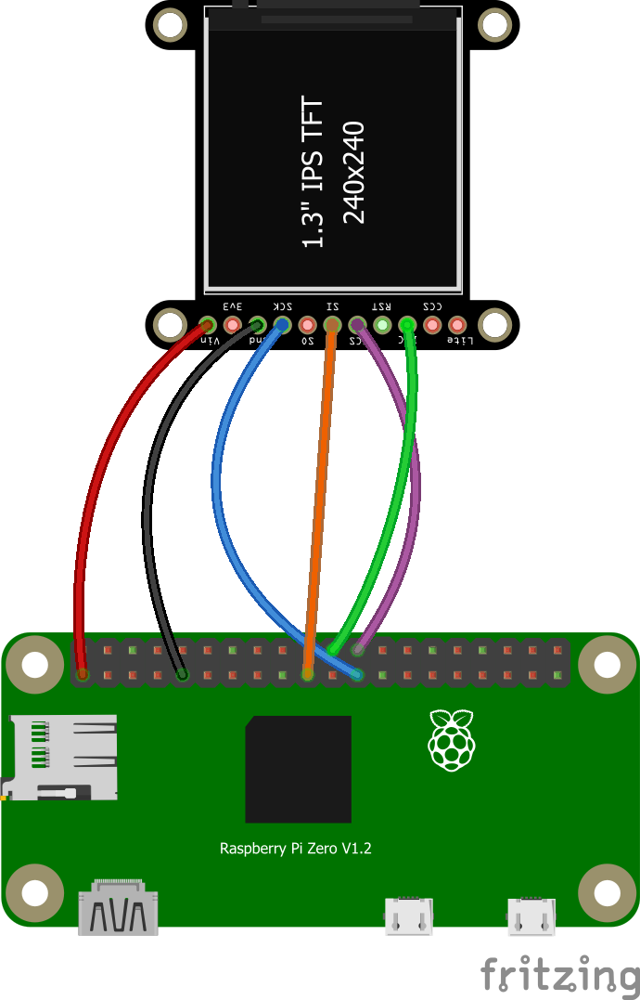

# What is a MandoPuter Pi?

A basic electronics system that will display Mandalorian characters and animations on a small display using a [Raspberry Pi Zero](https://www.raspberrypi.org/products/raspberry-pi-zero/). Use this as a starting point for adding displays to your costume (like a gauntlet). Feel free to copy the design, modify it, or make feature requests. This is the way! 

What is the difference between the original MandoPuter and a Mandoputer Pi?
* The original [MandoPuter](https://github.com/Breazile/MandoPuter) has a longer battery life, but is best suited for text and one image
* The [MandoPuter Pi](https://github.com/Breazile/MandoPuterPi) has lot more memory and can display multiple images including animated GIFs at the cost of lower battery life

**This guide is still a work in progress**

## Parts list:

You will need the following parts:

1. One supported display:
    * [1.14" LCD](https://www.adafruit.com/product/4383)  **<--- preferred display for the [pre-Beskar](https://www.etsy.com/listing/751008521/the-mandalorian-bracers?ref=shop_home_active_7&crt=1) gauntlet**
    * [1.30" LCD](https://www.adafruit.com/product/4313)  **<--- preferred display for the [Beskar](https://www.etsy.com/listing/765735752/the-mandalorian-beskar-bracers?ref=shop_home_active_8&crt=1) gauntlet**
2. [Raspberry Pi Zero](https://www.raspberrypi.org/products/raspberry-pi-zero/) or [Raspberry Pi Zero W](https://www.raspberrypi.org/products/raspberry-pi-zero-w/) (the Zero W has built-in Wi-Fi and Bluetooth)
3. Suggested 5V power supplies (connected to the board, or powered through the micro USB connector)
    * [PiSugar](https://www.tindie.com/products/pisugar/pisugar-battery-for-raspberry-pi-zero/) product page [here](https://www.pisugar.com/)
    * [PiSugar2](https://www.tindie.com/products/pisugar/pisugar2-battery-for-raspberry-pi-zero/) product page [here](https://www.pisugar.com/)
    * [Zero Lipo](https://blog.pimoroni.com/zero-lipo/) and [LiPoly battery](https://www.adafruit.com/category/916) 1200 mAH or larger. Zero Lipo available on [Amazon](https://www.amazon.com/gp/product/B01JO2UK3Q/ref=ppx_yo_dt_b_asin_title_o02_s00?ie=UTF8&psc=1)
    * [PowerCore 5000](https://www.anker.com/products/variant/powercore-5000/A1109011) or similar USB battery pack
    * [Mi Power Core](https://www.mi.com/sg/pb10000/)
4. [MicroSDHC Card](https://www.amazon.com/Sandisk-Ultra-Micro-UHS-I-Adapter/dp/B073K14CVB/ref=sr_1_3?dchild=1&keywords=micro+sd+card&nav_sdd=aps&pd_rd_r=1dbc4bbf-5950-4a95-a9fb-50512beec6d8&pd_rd_w=WMNh9&pd_rd_wg=lEGxd&pf_rd_p=f8813af5-8d61-4988-b701-57bd7e498604&pf_rd_r=BJNATXM0ARFX16F2RKS1&qid=1602266511&refinements=p_n_feature_two_browse-bin%3A6518303011&s=pc&sr=1-3) 16GB preferred, speed class 10
5. MicroSDHC card reader for your PC - you'll need to flash an image to the card
6. Small Gauge (22-30) [Wire](https://www.amazon.com/Stranded-Nano-Flexible-Insulated-Electrical/dp/B07DCV7BDD/ref=sr_1_1_sspa?keywords=24+gauge+wire&qid=1577768346&sr=8-1-spons&psc=1&spLa=ZW5jcnlwdGVkUXVhbGlmaWVyPUEzR1IxUzhXVlJRMFoxJmVuY3J5cHRlZElkPUEwMjE2ODM0MTRRSVkyQlBIRTZJSiZlbmNyeXB0ZWRBZElkPUEwNzE2MTQ1UURZTURJT0VDUEMzJndpZGdldE5hbWU9c3BfYXRmJmFjdGlvbj1jbGlja1JlZGlyZWN0JmRvTm90TG9nQ2xpY2s9dHJ1ZQ==) to connect the display

## Optional parts if you want to log in locally to customize the display sequence:
Unlike the Zero, the Zero W has Wi-Fi, so you can SSH into it remotely without the need for a keyboard, mouse, and monitor

1) [Micro USB to USB OTG adapter](https://www.amazon.com/Ksmile%C2%AE-Female-Adapter-SamSung-tablets/dp/B01C6032G0/ref=sr_1_5?dchild=1&keywords=micro+usb+to+usb&qid=1602266728&sr=8-5) for connecting a wireless keyboard/mouse combo - or -
2) [Micro USB hub](https://www.amazon.com/gp/product/B01JL837X8/ref=ppx_yo_dt_b_asin_title_o03_s00?ie=UTF8&psc=1) is another option if you need to connect more than one USB device to the Raspberry Pi
3) [Keyboard and Mouse](https://www.amazon.com/gp/product/B00Z81U3YY/ref=ppx_yo_dt_b_asin_title_o03_s00?ie=UTF8&psc=1) These can be separate, or a combo unit like I have linked here
4) [Micro HDMI adapter](https://www.amazon.com/GearIt-Micro-HDMI-Adapter-Type/dp/B00V5KRF66/ref=sr_1_8?dchild=1&keywords=micro+hdmi+to+hdmi+adapter&qid=1602266935&s=electronics&sr=1-8) to connect and external monitor (you'll need an HDMI monitor and cable)

## Recommended Tools:

1) Fine tip [Soldering Iron](https://www.amazon.com/Hakko-FX888D29BY-ESD-Safe-Digital-Soldering/dp/B00OSM27T8?ref_=ast_bbp_dp) (I use a Hakko FX-100, but any fine tip will work)
2) Solder ([what I'm using](https://www.amazon.com/gp/product/B00FGHTZFI/ref=ppx_yo_dt_b_search_asin_title?ie=UTF8&psc=1))
3) Solder flux ([what I'm using](https://www.amazon.com/gp/product/B01N8ZX7ZQ/ref=ppx_yo_dt_b_search_asin_title?ie=UTF8&psc=1))
4) [Micro Cutters](https://www.amazon.com/gp/product/B0765NMV68/ref=ppx_yo_dt_b_search_asin_title?ie=UTF8&psc=1)
5) [Wire Strippers](https://www.amazon.com/dp/B000XEUPMQ/ref=twister_B07JCDW6X6?_encoding=UTF8&psc=1)
6) [Tweezers](https://www.amazon.com/gp/product/B01MA5CCDO/ref=ppx_yo_dt_b_search_asin_title?ie=UTF8&psc=1)
7) [Isopropyl Alcohol](https://www.amazon.com/gp/product/B005DNQX3C/ref=ppx_yo_dt_b_search_asin_title?ie=UTF8&psc=1) for cleaning solder flux
8) A computer with a USB port

## I have the parts, now what do I do?

You'll follow 3 main steps to get things setup:

1) Setup the Raspberry Pi Zero or Zero W (flash the image to the SD card)
2) Solder the LCD
3) Connect power

**Optional** - customize the character sequence and/or add graphics (details below)

That's it, no need to write any code or use any other fancy tools. The default setup will display text sequences, so no editing is required. The character sequences are as close as I can get analyzing many frames from the show and behind the scenes. From there you can make changes to the sequence, or add images or GIF animations.

### 1a. Raspberry Pi Zero W Setup

These steps only apply to the **Raspberry Pi Zero W** board (Wi-Fi version). If you have a **Raspberry Pi Zero** follow the steps in 1b below. Setup is simple, we will complete the following:
1) Download the right image :floppy_disk: to your PC and flash it to the SD card
2) Customize your Wi-Fi setting, so you can access it remotely. This is not required, but another way to connect and configure your MandoPuter if you do not have a keyboard and monitor connected to it
3) Insert the SD card into the Pi

**You will need to download one of the following images depending upon which display you are using:**

* [Raspberry Pi Zero W with 1.3" display](https://drive.google.com/file/d/1vukrPMTKi5wfDWzsYp8qWlQ3P56h42mr/view?usp=sharing) (best for the Beskar gauntlet)
* [Raspberry Pi Zero W with 1.14" display](https://drive.google.com/file/d/1l98J3hf_Yy0vpeedQ-yXtrtsyNcRdKSh/view?usp=sharing) (best for the pre-Beskar gauntlet)

**Now we will need to flash the image to the SD card**

- Download [balenaEtcher](https://www.balena.io/etcher/) and install it on your PC or Mac
- Connect an SD card reader with the SD card inside
- Open balenaEtcher and select from your hard drive the Raspberry Pi .img or .zip file you wish to write to the SD card
- Select the SD card you wish to write your image to
- Review your selections, then click Flash! to begin writing data to the SD card

As an alternative you can use dd on GNU/Linux or macOS: Change the path to your image file, /dev/sdcard is the path to your SD card device

**2. Configure your Wi-Fi by copying the wpa_supplicant.conf file to the root of your SD card.** More details [here](https://www.raspberrypi.org/documentation/configuration/wireless/headless.md)

**3. Insert the SD card into the Raspberry Pi** You can power it up to see if it will boot if you connect it to an external monitor. If not go to step 2 below and solder the LCD. 

### 1b. Raspberry Pi Zero Setup

WORK IN PROGRESS - I will add details once I have my Pi Zero board and create the images

These steps only apply to the **Raspberry Pi Zero** board (no Wi-Fi version). If you have a **Raspberry Pi Zero W** follow steps in 1a above. Setup is simple, we will complete these steps:
- Download the right image to your PC and flash it to the SD card
- Insert the SD card into the Pi and power on

### 2. Solder the LCD

Solder the display to the Raspberry Pi according to the diagram below (not all display pins are used). Depending upon how you intend to power your Pi, you may not need a 40 pin header. Both the displays are the same, so the wiring is identical. Adafruit has a great [soldering guide](https://learn.adafruit.com/adafruit-guide-excellent-soldering) if you are new to soldering. The only thing they did not mention is adding flux to the solder joint first. That makes it much easier to make a good solder joint, and you only need to touch the parts for a second or two.

Raspberry Pin | LCD Pin
------------ | -------------
1 - 3.3 VDC | Vin (do not use 3V)
9 - GND | GND
23 - SPI SCLK | SCK
19 - SPI MOSI | MOSI or SI
24 - SPI CE0 | TFTCS or TCS
22 - GPIO6 | DC or D/C

* Raspberry Pi pinout details are documented [here](https://pi4j.com/1.2/pins/model-zerow-rev1.html)
* The MandoPuter Pi supports displays connected via SPI port with the ST7789 chipset. Other SPI displays are possible with different chips, and I will evaluate other options if they are needed. We do not use a display connected through the HDMI port other than configuring the sequence.

### 3. Insert the SD card and power on the Raspberry Pi

Coming soon

### 4. Optional - customize your setup

More detail coming soon

These are 2 scripts that you can modify to customize what is shown on the display:
* **/home/pi/mandoputer/showtext.py** - Displays text sequences followed by graphics sequences
* **/home/pi/mandoputer/showgif.py** - Displays animated GIF files on the display

You can modify these scripts, and then copy one to **/home/pi/mandoputer/autorun.py** so it will run automatically on boot.

## Want to know more?

SparkFun has a nice [tutorial](https://learn.sparkfun.com/tutorials/getting-started-with-the-raspberry-pi-zero-wireless/all) on the Raspberry Pi Zero W. This applies to the Zero model as well minus the Wi-Fi part.

Tom's Hardware has a nice [article](https://www.tomshardware.com/features/raspberry-pi-zero) that goes into the specs and details of the Zero models. It has a getting started guide as well.

Adafruit has a nice [PDF guide](https://cdn-learn.adafruit.com/downloads/pdf/introducing-the-raspberry-pi-zero.pdf) that goes through the features of the Raspberry Pi Zero W.

- [Raspberry Pi Help/Guides](https://www.raspberrypi.org/help/)
- [Raspberry Pi Community](https://www.raspberrypi.org/community/)
- [Raspberri Pi Forums](https://www.raspberrypi.org/forums/)

You should be ready to go. Give the system a minute or two to boot up, and you should see the display come to life.
